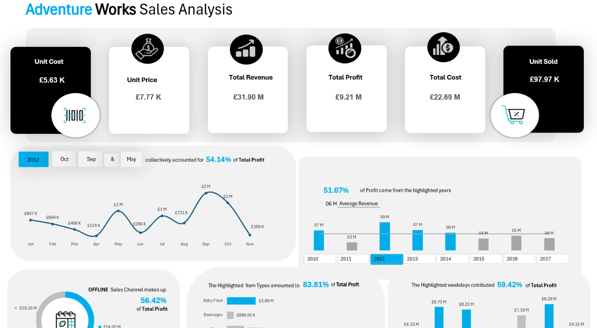

# Project 1

**Title 1:** [Adventure Works Sales Analysis](https://github.com/eocreates/eocreates.github.io/blob/main/Adventure%20Works.xlsx)

**Tool Used:** Advance Microsoft Excel (Pivot Table, Pivot Charts, Power Pivot, Power Query, Slicers, Timeline)

**Project Discription**

**Key Findings**

**Dashboard overview**

# Projet 2

**Title:**

**SQL Code:**

**SQL Skills Used:**

**Project Description:**

**Technology used: SQL server**

Data Retrieval (SELECT): Queried and extracted specific information from the database.
Data Aggregation (SUM, COUNT): Calculated totals, such as sales and quantities, and counted records to analyze data trends.
Data Filtering (WHERE, BETWEEN, IN, AND): Applied filters to select relevant data, including filtering by ranges and lists.
Data Source Specification (FROM): Specified the tables used as data sources for retrieval
