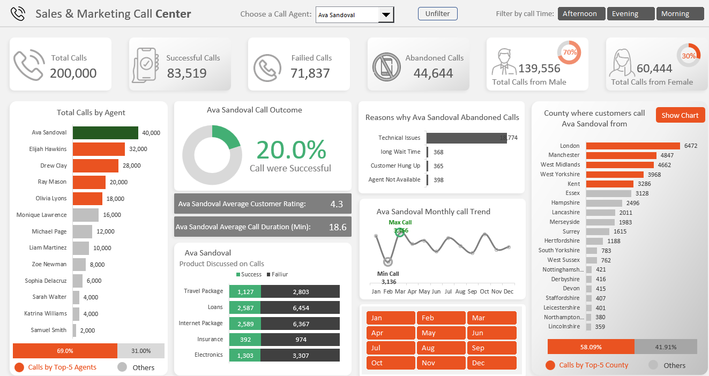
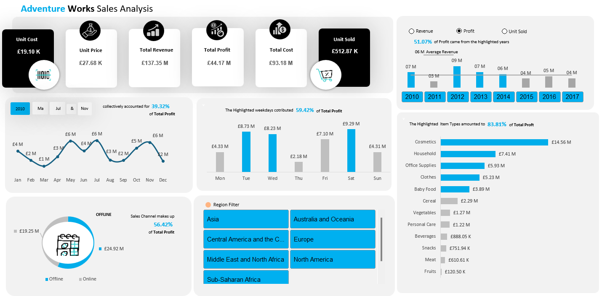

# Sales and Marketing Call Center Analysis (MICROSOFT EXCEL)
**Title:** [Sales and Marketing Call Center](https://github.com/eocreates/eocreates.github.io/blob/main/Callcentersales.xlsb)

**Tool Used:** Advance Microsoft Excel (Pivot Table, Pivot Charts, Power Pivot, Power Query, VBA, Slicers, Timeline)

**Project Discription:**  This project focuses on developing an interactive Call Center Dashboard delivering key insights into overall call operations, with a strong focus on individual agent performance and customer behavior. It will display call metrics, agent success rates, products discussed, and customer locations, while tracking monthly and time-series trends. Additionally, it will identify reasons for unsuccessful calls, all in a clean, user-friendly design to support smarter decision-making.

**Call Center Performance Overview:**

• Handled 200,000 calls, with 41.76% successful, 35.92% failed, and 22.32% abandoned.

• Top-performing agent: Ava Sandoval, handling 40,000 calls.

• Top 5 agents collectively handled 69% of calls, leaving 31% to other 10 agents.

• Insurance was the most frequently discussed product, while technical issues were the leading cause of abandoned calls.

• Customer engagement concentrated in urban areas (58.09% from top five counties).

• 70% of calls were male, 30% female.

• Afternoon recorded the highest number of calls received.

N.B: Agent performance varies; use the dropdown at the top of the dashboard to view detailed insights for each individual agent.

**Dashboard overview**

# Adventure Works Sales Analysis (MICROSOFT EXCEL)
**Title:** [Adventure Works Sales Analysis](https://github.com/eocreates/eocreates.github.io/blob/main/Adventure%20Works.xlsx)

**Tool Used:** Advance Microsoft Excel (Pivot Table, Pivot Charts, Power Pivot, Power Query, Slicers, Timeline)

**Project Discription:**  The Adventure Works Sales Analysis project is a comprehensive business intelligence initiative aimed at evaluating and understanding the company's historical sales performance. Leveraging key metrics such as revenue, profit, unit sales, and cost data, the project provides actionable insights into product category performance, sales channel effectiveness, temporal sales trends, and customer buying behavior.

**Adventure Works Sales  Overview:**

• A total revenue of £137.35 million was recorded, with a net profit of £44.17 million from selling 512.87K units.

• A combined 52% of the total revenue was generated in the years 2010, 2012, and 2013 averaging approximately £17 million in revenue.

• The year 2012 recorded the highest profit, while Tuesday, Wednesday, and Saturday collectively accounted for 54.2% of the total profit.

• Offline sales outperformed online, with cosmetics being the top performer item type.

**Dashboard overview**

# Workplace Safety Analysis (SQL)
**Title:** Workplace Safety Analysis
**SQL Code:** [WorkplaceSafetyAnalysis SQL Code](https://github.com/eocreates/eocreates.github.io/blob/main/WORKPLACE%20SAFETY%20DATA.sql)

**SQL Skills Used:** Aggregation Functions: COUNT(), SUM(), AVG(), MAX(): Used to calculate counts, sums, averages, and maximum values for various columns like incidents, costs, and days lost.

Grouping Data: GROUP BY: Groups data by specific columns (e.g., department, plant) to allow aggregation.

Filtering Data:

WHERE: Filters data before aggregation, e.g., to focus on specific incident types or report types.

HAVING: Filters data after grouping, e.g., to find departments with incidents lasting more than two days.

Window Functions: ROW_NUMBER(): Assigns a unique number to rows based on specified ordering, used for ranking incidents or reports.

Date and Time Functions: YEAR(), MONTH(), FORMAT(): Extracts and formats date values for grouping incidents by year, month, or shift.

Subqueries and Common Table Expressions (CTEs):

WITH clause: Used to create reusable query blocks (CTEs) for ranking or filtering data (e.g., ranking departments by incident counts).

Sorting Data: ORDER BY: Sorts results by specified columns in ascending or descending order.

**Project Description:** This project involves analyzing workplace safety data to identify patterns and trends related to incidents, costs, and the impact on employees. Using SQL queries to explore a comprehensive dataset, the goal is to provide actionable insights into the frequency and severity of incidents, their associated costs, and the factors influencing safety in the workplace. The analysis covers various aspects, such as incident types, departments, shifts, age groups, plants, and costs, with a focus on identifying high-risk areas and opportunities for improvement

**Technology used: SQL server**

# Project 3

**Title :** Dominoz pizza

**Tool Used:** Power Bi (Dax....)

